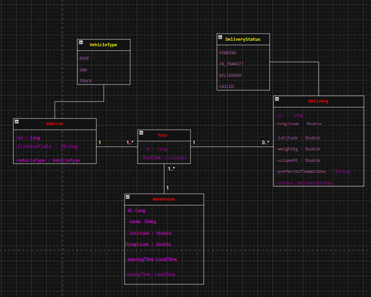

# 🚚 Système de Gestion et d’Optimisation des Tournées de Livraison

## 🧩 1. Description du projet

Ce projet est une **application web développée avec Spring Boot** visant à aider une entreprise logistique à **optimiser les tournées de livraison** de ses colis. Le système actuel repose sur l’algorithme simple du **plus proche voisin (Nearest Neighbor)**, mais fait face à des défis tels que l’augmentation des coûts de carburant et la croissance du nombre de clients, générant des itinéraires inefficaces.

### 🎯 Objectifs

L’application développée permet de :
* Gérer une flotte de véhicules hétérogène (**Vehicles**) avec leurs contraintes spécifiques (capacité max poids, volume max, nombre max de livraisons).
* Gérer les livraisons (**Deliveries**) et leurs détails (coordonnées GPS, poids, volume, créneau horaire optionnel).
* Gérer les entrepôts (**Warehouse**) comme points de départ et d'arrivée.
* Implémenter l’algorithme **Clarke & Wright (Savings Algorithm)** pour optimiser les tournées (**Tour**) et réduire les distances parcourues.
* Permettre la **comparaison des performances** entre l'algorithme **Nearest Neighbor** existant et le nouvel algorithme **Clarke & Wright**.
* Fournir une **API REST** pour gérer toutes les entités (CRUD) et déclencher le processus d’optimisation.

---

## ⚙️ 2. Contrainte principale : Injection de dépendances manuelle via XML

Une exigence stricte de ce projet est **l'interdiction d'utiliser les annotations Spring pour l'injection de dépendances** (`@Autowired`, `@Service`, `@Component`, `@Repository`, etc.).

À la place, **tous les Beans** (Services, Mappers, Controllers, Optimizers, Repositories) et leurs dépendances sont configurés **manuellement** dans le fichier :
`src/main/resources/applicationContext.xml`.

🎓 **Objectif pédagogique :** Approfondir la compréhension du mécanisme d'Inversion de Contrôle (IoC) de Spring et appliquer le principe Ouvert/Fermé (Open-Closed Principle).

---

## 🛠️ 3. Technologies utilisées

| Technologie               | Description                                                                 |
| :------------------------ | :-------------------------------------------------------------------------- |
| **Java 17** | Langage principal (avec Stream API & Java Time API)                         |
| **Spring Boot 3.x** | Framework principal (Web, Data JPA)                                         |
| **Spring Data JPA** | Accès aux données et gestion des Repositories                               |
| **H2 Database** | Base de données relationnelle (sur fichier ou en mémoire)                     |
| **Maven** | Outil de gestion de projet et de build                                      |
| **Lombok** | Réduction du code répétitif (boilerplate) avec annotations (`@Data`, `@Builder`) |
| **Springdoc OpenAPI (Swagger)** | Documentation et visualisation interactive de l'API REST                  |
| **JUnit 5 & Mockito** | Frameworks pour les tests unitaires                                         |
| **Design Patterns** | Repository, DTO, Mapper, Strategy                                           |

---

## ▶️ 4. Instructions d’exécution

### 🔧 Prérequis

* JDK 17 ou version supérieure installé.
* Maven installé et configuré dans le PATH.

### 🚀 Étapes

1.  **Cloner le dépôt :**
    ```bash
    git clone <https://github.com/ABDERRAZZAK-IMILY/Syst-me-de-Gestion-Optimis-e-de-Tourn-es-de-Livraison-.git>
    cd Syst-me-de-Gestion-Optimis-e-de-Tourn-es-de-Livraison- 
    ```
2.  **(Optionnel) Configurer les variables d'environnement :**
    * Créer un fichier `.env` à la racine du projet (il est ignoré par `.gitignore`).
    * Définir les variables si nécessaire (voir `.env` pour les valeurs par défaut) :
        ```env
        APP_NAME=delivery-optimizer
        DB_URL=jdbc:h2:file:~/deliverydb # Ou jdbc:h2:mem:deliverydb pour la version mémoire
        DB_USERNAME=sa
        DB_PASSWORD=
        ```
3.  **Exécuter le projet :**
    ```bash
    mvn spring-boot:run
    ```
4.  L'application démarre sur `http://localhost:8080` (ou le port défini).

---

## 🧭 5. Accès aux outils intégrés

* **💾 H2 Console :**
    * Accès direct à la base de données via le navigateur.
    * URL : `http://localhost:8080/h2-console`
    * **JDBC URL :** `jdbc:h2:file:~/deliverydb` (ou `jdbc:h2:mem:deliverydb`)
    * **Username :** `sa`
    * **Password :** (laisser vide)

* **📘 Swagger UI :**
    * Documentation interactive de l'API REST.
    * URL : `http://localhost:8080/swagger-ui.html`

   # api collection :

https://2m25w6fpp7.apidog.io/create-vehicle-23345747e0 

---

## 🧪 6. Test de l’API

Utiliser **Postman** ou un outil similaire pour tester les endpoints de l'API.

Une **collection Postman** (`postman.json`) est fournie dans le projet. Importer ce fichier dans Postman pour accéder rapidement à des exemples de requêtes pour :
* Le CRUD des entités (`Vehicles`, `Deliveries`, `Warehouses`).
* Le déclenchement de l'optimisation de tournée (`POST /api/v1/tours/optimize`).

---

## 🧱 7. Diagramme UML du modèle de données



---

## 🧠 8. Structure du projet

```

com.logistics.delivery_optimizer
├── Controller/ # Couche API (REST Controllers)
│ ├── VehicleController.java
│ ├── DeliveryController.java
│ ├── WarehouseController.java
│ └── TourController.java
│
├── dto/ # Couche DTO (Data Transfer Objects)
│ ├── VehicleRequestDTO.java
│ ├── VehicleResponseDTO.java
│ └── ... (autres DTOs)
│
├── mapper/ # Couche Mapper (Conversion DTO <-> Entity)
│ ├── VehicleMapper.java
│ └── ... (autres Mappers)
│
├── Model/ # Couche Modèle (Entités JPA & Enums)
│ ├── Entities/
│ │ ├── Vehicle.java
│ │ ├── Delivery.java
│ │ ├── Warehouse.java
│ │ └── Tour.java
│ │
│ └── Enums/
│ ├── VehicleType.java
│ └── DeliveryStatus.java
│
├── repository/ # Couche Repository (Accès aux données - Spring Data JPA)
│ ├── VehicleRepository.java
│ └── ... (autres Repositories)
│
├── service/ # Couche Service (Logique métier)
│ ├── VehicleService.java (Interface)
│ ├── VehicleServiceImpl.java (Implémentation)
│ ├── ... (autres Services)
│ │
│ └── optimizer/ # Sous-package pour les algorithmes (Strategy Pattern)
│ ├── TourOptimizer.java (Interface Stratégie)
│ ├── NearestNeighborOptimizer.java (Implémentation)
│ └── ClarkeWrightOptimizer.java (Implémentation)
│
├── util/ # Utilitaires
│ └── DistanceCalculator.java
│
├── DeliveryOptimizerApplication.java # Point d'entrée Spring Boot
│
└── resources/
├── application.properties # Configuration générale & DB
└── applicationContext.xml # Configuration manuelle des Beans (IoC)

```
---

## 📈 9. Comparaison des Algorithmes (Objectif du projet)

| Algorithme         | Description                                     | Avantages                                      | Inconvénients                               |
| :----------------- | :---------------------------------------------- | :--------------------------------------------- | :------------------------------------------ |
| **Nearest Neighbor** | Choisit toujours la livraison la plus proche   | Très rapide, simple à implémenter            | Génère souvent des trajets longs, sous-optimal |
| **Clarke & Wright** | Calcule les "économies" et fusionne les trajets | Réduit significativement la distance totale | Plus complexe, temps de calcul acceptable   |

Le changement d'algorithme utilisé par `TourService` se fait **uniquement** en modifiant la référence (`ref`) dans la définition du bean `tourServiceImpl` dans `applicationContext.xml`.

---

## 🧩 10. Tests unitaires (en cours)

Les tests sont développés avec **JUnit 5** et **Mockito**.
* Les fichiers de test se trouvent dans `src/test/java/com/logistics/delivery_optimizer/service/`.
* Exemple : `VehicleServiceTest.java`.

Pour exécuter les tests :
```bash
mvn test
```

# 👤 12. Auteur
Développé par : IMILY ABDERRAZZAK
